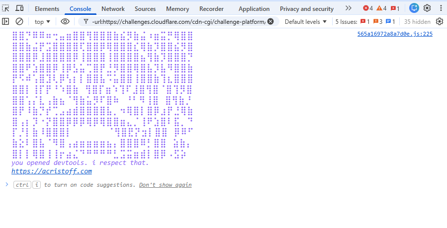

# console-chan

A zero-dependency package with optional React bindings that logs anime-themed ASCII art to the console.



## Install

```bash 
  npm i console-chan
```

## Quick start

```ts
import { logConsoleArt } from "console-chan";

logConsoleArt();
```
> In Node.js, output is plain text without color styling.

## Options
```ts
LogOptions {
  color: hex string (Default: "#8b5cf6"),
  fontSize: string (Default: 18px),
  taglineFontSize: string (Default: 14px),
  frequency: "once" | "navigate" (Default: "once")
}
```

Once logs once on the console and navigate logs on navigation in your SPA.

## API

`logConsoleArt(options?: LogOptions)`
Logs a random art piece + tagline to console. In Node, outputs plain text (no color styling).

`getRandomArt(): string`
Returns a random art string from the bank.

`getRandomTagline(): string`
Returns a random tagline string.

`CONSOLE_ART: string[]`
The full array of art pieces.

`TAGLINES: string[]`
The full array of taglines.

## React usage

```tsx
import { ConsoleArt } from "console-chan/react";

function App() {
  return <ConsoleArt />;
}
```
Or use the hook
```tsx
import { useConsoleArt } from "console-chan/react";

function App() {
  useConsoleArt({ color: "#ff0000" });
  return <div>...</div>;
}
```

## Contributing
Go to [CONTRIBUTING.md](CONTRIBUTING.md)

MIT license